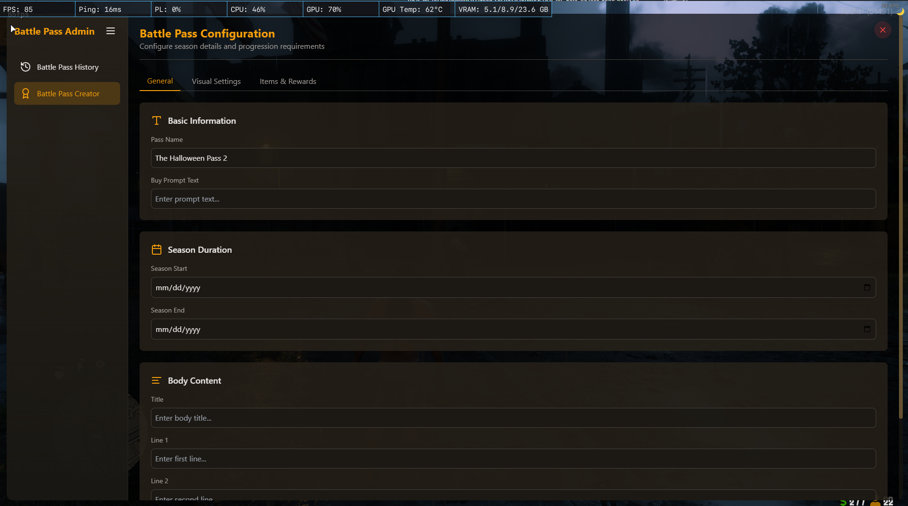
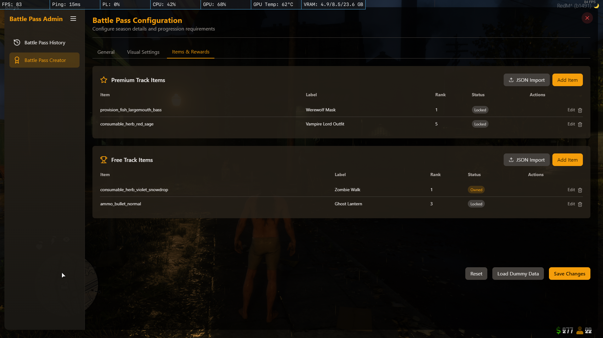
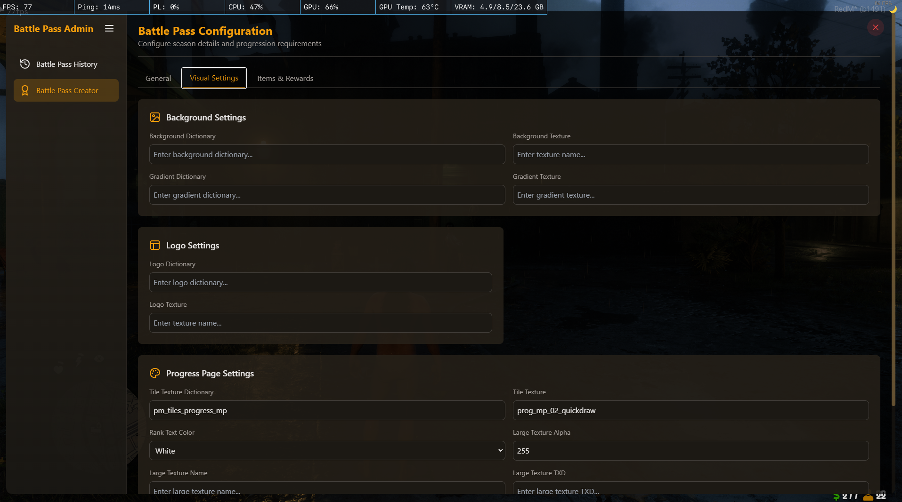
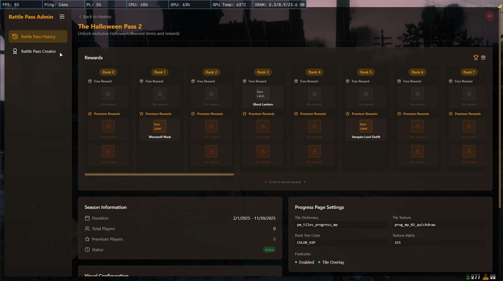
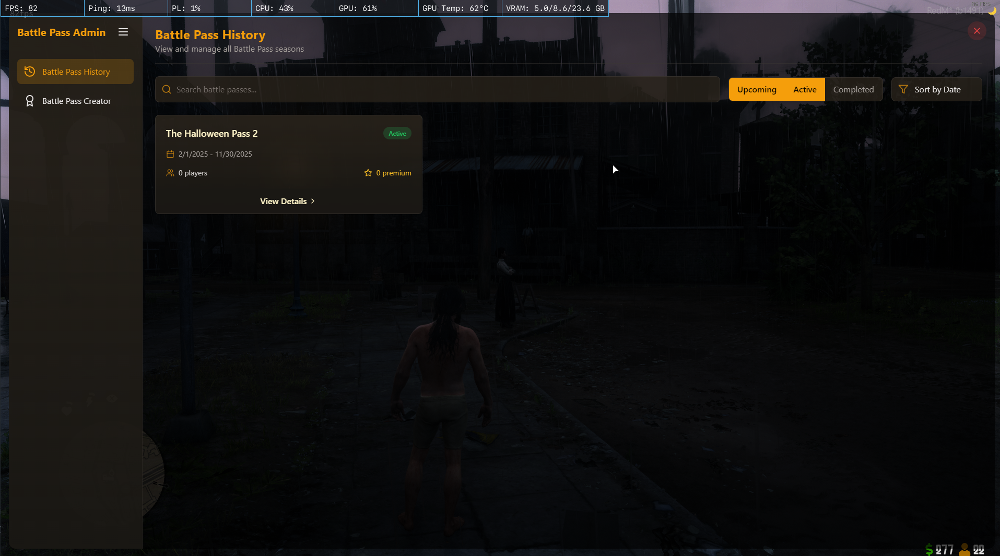

# Seaon Pass Creator

A simple web application to create and manage season passes with qadr_ui

# Explore qadr_ui

[Docs](https://abdulkadir-aktas.gitbook.io/qadr_docs/qadr_ui)

[Buy](https://west-world.tebex.io/package/5165474)

[Forum](https://forum.cfx.re/t/paid-qadr-ui-standalone/4872625)

Video Play List :
https://www.youtube.com/watch?v=LxdI-Ez4pVE&list=PLchFjqoahGcmI997Gtbue4o6GhGtPrGpR&index=1

## Features

- Create a pass by selecting a template
- Set the pass details
- Customize the visual settings
- View the pass history
- Delete a pass
- Edit a pass -- Not implemented yet

## Screenshots

